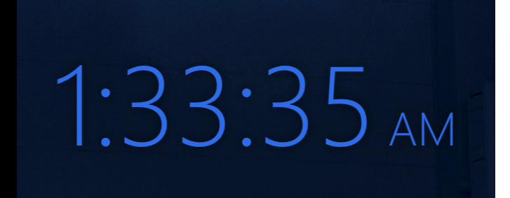
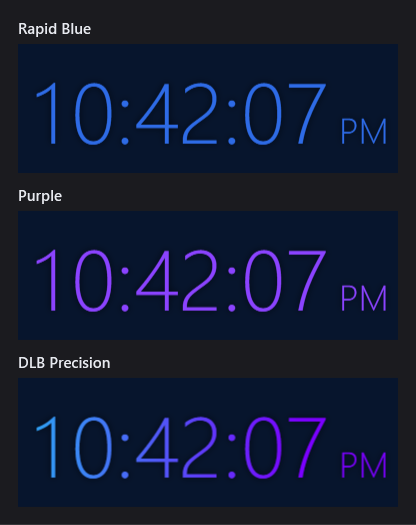

# DLB Precision Desktop Clock

A transparent, resizable digital clock widget for Windows 11, in Chevrolet Rapid Blue, purple, or
DLB Precision colors.



No installer, no runtime to ship, no dependencies — it compiles with the C# compiler that is
already inside Windows and produces a single ~22 KB `.exe`.

- **16 MB** working set, **0.00% CPU** at idle (it sleeps between ticks and wakes aligned to the
  second boundary, so it never drifts and never busy-loops)
- Genuinely transparent background — no black box, no fake-wallpaper trick
- Always on top, hidden from Alt+Tab and the taskbar
- Remembers its exact position, size, and color across restarts and reboots

## Colors



Right-click → **Color** to switch. The choice is remembered.

| Color | Value |
| --- | --- |
| Rapid Blue | `#2E6BE6` |
| Purple | `#8B43FF`, the violet from the [DLB Precision](https://www.dlbprecision.com) logo |
| DLB Precision | `#2DA4F4` → `#4A66F7` → `#7B00FF`, the dlbprecision.com gradient, swept from the first digit to the end of AM/PM, solid violet from the middle on |

## Download

Grab `DlbPrecision.DesktopClock.exe` from the [latest release](../../releases/latest), drop it in a folder it
can live in permanently, and double-click it. It registers itself to start with Windows on that
first run. The `.exe` is not code-signed, so SmartScreen will show "Windows protected your PC"
the first time — click **More info → Run anyway**.

## Build

Or build it yourself. Clone the repo, then:

```powershell
powershell -ExecutionPolicy Bypass -File .\build.ps1
```

That compiles `DlbPrecision.DesktopClock.exe` next to the script and starts it; the clock adds
itself to Start with Windows when it runs. `-NoLaunch` builds without starting it. The version
comes from the `VERSION` file; tests run with `.\test.ps1`.

The build uses `%WINDIR%\Microsoft.NET\Framework64\v4.0.30319\csc.exe`, which ships with
Windows 10 and 11. Nothing needs to be installed.

## Using it

| Action | How |
| --- | --- |
| Move | Drag anywhere on the clock |
| Resize | Scroll wheel over it, or drag any edge or corner |
| Resize precisely | Right-click → Bigger / Smaller / Reset size |
| Change color | Right-click → Color → Rapid Blue / Purple / DLB Precision |
| Freeze it | Right-click → Lock position |
| Start with Windows | Right-click → Start with Windows |
| Quit | Right-click → Exit |

The window is invisible apart from the digits, so a faint outline in the clock's color appears
when you hover over it to show you where the draggable edges are. The aspect ratio is locked
while resizing, so dragging any edge scales the whole readout — it can never be squashed out of
proportion.

## Where state lives

| What | Where |
| --- | --- |
| Position, size, color, lock state | `%LOCALAPPDATA%\DLBPrecision\DesktopClock\settings.ini` |
| Start-with-Windows entry | `HKCU\Software\Microsoft\Windows\CurrentVersion\Run` → `DLBPrecisionDesktopClock` |

Settings are written ~0.7 s after you stop dragging, and again on exit and on Windows shutdown.
Only *your* moves count: if Windows shoves the window onto another screen because a monitor
went to sleep or was unplugged, the remembered spot is untouched, and the clock moves back the
moment that monitor returns. If the remembered spot is off every screen when the clock starts,
it parks top-right on the primary screen until the monitor comes back.

Every launch re-asserts the start-with-Windows choice: if the entry is missing or points at an
old location (you moved the `.exe`), it is rewritten; if you turned it off in the menu, it is
removed. So running the `.exe` once is enough to install it.

## Uninstall

Right-click → untick **Start with Windows**, right-click → **Exit**, then delete the folder and
`%LOCALAPPDATA%\DLBPrecision\DesktopClock` (and `%APPDATA%\ChevyClock`, if it's left over from
Chevy Clock 1.2 or older).

## Customizing

Everything worth changing is at the top of [`DesktopClock.cs`](DesktopClock.cs):

| Constant | Does |
| --- | --- |
| `Themes` | The entries in the Color menu: name, digit brush, hover-outline tint. Add a row to add a color |
| `RapidBlue`, `LogoViolet`, `DlbSky` / `DlbBlue` / `DlbViolet` | The color values those entries use |
| `GRIP` | Width of the drag-to-resize band, in pixels |
| `STEP` | How much one wheel notch grows the clock |
| `MIN_W` / `MAX_W` | Size limits |

The time format lives in `UpdateTime()` — `"h:mm:ss"` plus `"tt"` for AM/PM. Swap it for `"HH:mm"`
and drop the `ampmRun` for a 24-hour clock. The font is set in `BuildContent()`.

## Notes

The widget is system-DPI aware. On a mixed-scaling multi-monitor setup, the digits soften slightly
on monitors that are not at the system scale.
